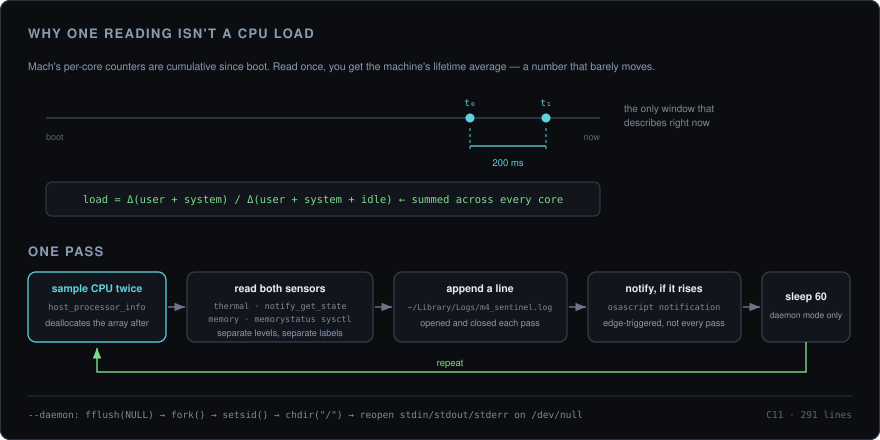

<div align="center">

# m4-sentinel

**A 291-line C daemon that watches what Apple Silicon is actually doing.**

Native Mach, sysctl, and notify calls, no dependencies, no runtime — one binary and a log file.

<p>
  
  
  
  
  
</p>

<br />



<sub>The whole trick is on the left: Mach hands you totals since boot, so a load figure only exists between two readings.</sub>

</div>

<br />

---

## The short version

A background monitor for Apple Silicon Macs, written in C11 against the native APIs — `host_processor_info` for per-core CPU ticks, `notify(3)` for thermal pressure, `sysctlbyname` for memory pressure, `fork()` + `setsid()` to detach. It appends a timestamped line every 60 seconds and fires a system notification when either pressure level rises past its threshold.

```bash
make
./sentinel              # one-shot reading, prints and logs
./sentinel --daemon     # detach and sample every 60s
```

That's the entire interface, plus `--log <path>` to redirect the log.

---

## Thermal and memory are two different sensors

They get conflated constantly, so this tool reads them separately and labels them separately.

**Thermal pressure** comes from the notify(3) key `libkern` publishes as `kOSThermalNotificationPressureLevelName` — `com.apple.system.thermalpressurelevel`. Register a check token once, then `notify_get_state()` per pass. On macOS the levels are:

| Value | `OSThermalPressureLevel` |
|---|---|
| 0 | `kOSThermalPressureLevelNominal` |
| 1 | `kOSThermalPressureLevelModerate` |
| 2 | `kOSThermalPressureLevelHeavy` |
| 3 | `kOSThermalPressureLevelTrapping` |
| 4 | `kOSThermalPressureLevelSleeping` |

**Memory pressure** comes from `sysctlbyname("kern.memorystatus_vm_pressure_level", …)`, which reports the same constants dispatch exposes as `DISPATCH_MEMORYPRESSURE_NORMAL` (1), `WARN` (2), and `CRITICAL` (4). That sysctl is the polling equivalent of `DISPATCH_SOURCE_TYPE_MEMORYPRESSURE` — the dispatch source is the better API in general, but it delivers events on a queue, and a program whose whole structure is `check, sleep(60)` has no run loop to deliver them to.

<sub><b>Historical note.</b> Earlier versions of <code>sentinel.c</code> read <code>sysctlbyname("vm.pressure_level", …)</code> and printed the result as <code>Thermal:</code>. That was wrong twice over: the OID does not exist on modern macOS, so the read failed every pass and the value fell back to <code>0</code>; and even where it did exist it reported <i>memory</i> pressure, never thermal.</sub>

### When it notifies

Alerts are **edge-triggered** — they fire when a level first rises to or past its threshold, and again only if it climbs higher. A level-triggered check would re-post an identical notification every 60 seconds for as long as the condition lasted.

| Sensor | Threshold |
|---|---|
| Thermal | `>= kOSThermalPressureLevelModerate` |
| Memory | `>= DISPATCH_MEMORYPRESSURE_WARN` |

If a sensor cannot be read, it logs as `Unavailable (-1)` and never triggers an alert.

---

## What it measures, and why it takes two readings

`host_processor_info` returns **cumulative** tick counters per core — user, system, idle, all monotonically increasing since boot. Sample once and divide, and you get the machine's average utilisation over its entire uptime. On a Mac that's been awake for a week, that number is both stable and useless; it won't move whatever you throw at the CPU.

So `get_cpu_load()` takes two samples 200 ms apart and divides the deltas:

```
load = Δ(user + system) / Δ(user + system + idle)
```

summed across every core, which on an M-series chip means the performance and efficiency cores together. The counters are allocated by the kernel on each call, so the array is handed back with `mach_vm_deallocate` — skip that and a daemon sampling every 60 seconds leaks steadily for as long as it runs.

---

## Running it

```bash
git clone https://github.com/chakri192/m4-sentinel.git
cd m4-sentinel && make
```

Needs the Xcode Command Line Tools (`xcode-select --install`). The `Makefile` links CoreFoundation and IOKit and builds with `-Os -Wall -Wextra`.

| Invocation | Behaviour |
|---|---|
| `./sentinel` | One reading. Prints to stdout, appends one line, exits |
| `./sentinel --daemon` | `fork()`, `setsid()`, `chdir("/")`, then sample every 60s forever |
| `./sentinel --log <path>` | Log somewhere else. Combines with `--daemon` |

Stop the daemon with `pkill sentinel`.

### Where the log goes

**`~/Library/Logs/m4_sentinel.log`.** `$HOME` is expanded at runtime, and the directory is created if it somehow isn't there.

For debugging, point it anywhere:

```bash
./sentinel --log ./sentinel.log      # or: SENTINEL_LOG=./sentinel.log ./sentinel
```

`--log` wins over `SENTINEL_LOG` if both are set. Relative paths are resolved against the invoking cwd **before** anything forks, so `--log ./sentinel.log --daemon` still lands where you ran it rather than following the daemon to `/`. If `$HOME` is unset entirely, it falls back to `/tmp/m4_sentinel.log` and says so on stderr.

Actual format, one line per pass:

```
Thu Aug  6 01:27:19 2026 | Thermal: Nominal (0) | Memory: Normal (1) | CPU: 23.50%
```

`ctime()` timestamps, pipe-separated, each level printed as both name and raw value. Appended, never rotated — `: > ~/Library/Logs/m4_sentinel.log` to clear it.

---

## How the daemon detaches

```c
fflush(NULL);               // don't hand the child a copy of buffered output
if (fork() != 0) exit(0);   // parent leaves; the child is orphaned to init
setsid();                   // new session, no controlling terminal
chdir("/");                 // stop pinning the launch directory
freopen("/dev/null", ...)   // stdin, stdout, stderr
```

Four steps, three of which are easy to skip.

`fflush(NULL)` first: when stdout is a pipe or file rather than a terminal it is fully buffered, so anything printed before the fork is still sitting in the buffer — and `fork()` copies that buffer into the child, which then prints it a second time. Piping the startup banner into `cat` is enough to see it doubled.

`chdir("/")` matters because a process holds a reference to its working directory. A daemon launched from a USB volume or a directory you later want to delete keeps that directory alive for as long as it runs. Going to `/` releases it — which is exactly why the log path has to be resolved to an absolute path *before* this point.

`freopen` last: after `setsid()` the controlling terminal is gone, and every `printf` and `perror` in the program is writing to a file descriptor that no longer leads anywhere. Reopening the three standard streams on `/dev/null` makes those writes harmlessly succeed instead of failing — the real output was always the log file, which is opened separately per pass.

---

## APIs it uses

| Concern | Call |
|---|---|
| Per-core CPU ticks | `host_processor_info(mach_host_self(), PROCESSOR_CPU_LOAD_INFO, …)` |
| Freeing that array | `mach_vm_deallocate(mach_task_self(), …)` |
| Thermal pressure | `notify_register_check(kOSThermalNotificationPressureLevelName, …)` + `notify_get_state()` |
| Memory pressure | `sysctlbyname("kern.memorystatus_vm_pressure_level", …)` |
| Notification | `osascript -e 'display notification …'` via `system()` |
| Detaching | POSIX `fork()` + `setsid()` + `chdir("/")` |

---

## Layout

```
m4-sentinel/
├── sentinel.c     read_cpu_ticks · get_cpu_load · get_thermal_pressure
│                  get_memory_pressure · maybe_alert · run_daemon
├── Makefile       gcc -std=c11 -Os, links CoreFoundation + IOKit
└── docs/          the diagram in this README
```

---

## Contributors

| | |
|---|---|
| [chakri192](https://github.com/chakri192) | Author |
| [aider](https://github.com/Aider-AI/aider) | AI pair programmer |
