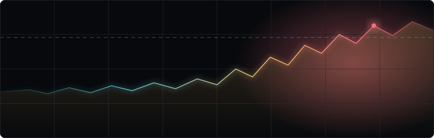

<div align="center">



# m4-sentinel

**A C daemon that watches what Apple Silicon is actually doing.**

Native Mach, sysctl, and notify calls. No dependencies, no runtime — one binary and a log file.

<p>
  
  
  
  
</p>

</div>

---

```bash
make
./sentinel              # one reading, printed and logged
./sentinel --daemon     # detach, sample every 60s
```

That's the whole interface, plus `--log <path>`.

## Thermal and memory are two different sensors

They get conflated constantly, so this reads them separately and labels them separately.

**Thermal** comes from the notify(3) key `libkern` publishes as `kOSThermalNotificationPressureLevelName`. Register a check token once, then `notify_get_state()` per pass. Levels run Nominal · Moderate · Heavy · Trapping · Sleeping.

**Memory** comes from `sysctlbyname("kern.memorystatus_vm_pressure_level", …)`, reporting the same constants dispatch exposes as `NORMAL` (1), `WARN` (2), `CRITICAL` (4). That sysctl is the polling equivalent of `DISPATCH_SOURCE_TYPE_MEMORYPRESSURE` — the dispatch source is the better API in general, but it delivers on a queue, and a program whose whole structure is `check, sleep(60)` has no run loop to deliver to.

> **Historical note.** Earlier versions read `sysctlbyname("vm.pressure_level", …)` and printed it as `Thermal:`. That was wrong twice: the OID doesn't exist on modern macOS, so the read failed every pass and fell back to `0`; and even where it existed it reported *memory* pressure, never thermal.

Alerts are **edge-triggered** — they fire when a level first rises past its threshold (thermal ≥ Moderate, memory ≥ WARN) and again only if it climbs higher. A level-triggered check would re-post an identical notification every 60 seconds for as long as the condition lasted. An unreadable sensor logs as `Unavailable (-1)` and never alerts.

## Why the CPU load takes two readings

`host_processor_info` returns **cumulative** tick counters per core, monotonically increasing since boot. Sample once and divide and you get the machine's average utilisation over its entire uptime — on a Mac awake for a week, that number is both stable and useless.

So `get_cpu_load()` takes two samples 200 ms apart and divides the deltas:

```
load = Δ(user + system) / Δ(user + system + idle)
```

summed across every core, performance and efficiency together. The kernel allocates that array on each call, so it's handed back with `mach_vm_deallocate` — skip that and a daemon sampling every 60 seconds leaks for as long as it runs.

## Running it

```bash
git clone https://github.com/chakri192/m4-sentinel.git
cd m4-sentinel && make
```

Needs the Xcode Command Line Tools. Stop the daemon with `pkill sentinel`.

Logs to `~/Library/Logs/m4_sentinel.log`, with `$HOME` expanded at runtime:

```
Thu Aug  6 01:27:19 2026 | Thermal: Nominal (0) | Memory: Normal (1) | CPU: 23.50%
```

`--log <path>` (or `SENTINEL_LOG`) redirects it; `--log` wins if both are set. Relative paths resolve against the invoking cwd **before** anything forks, so `--log ./sentinel.log --daemon` lands where you ran it rather than following the daemon to `/`.

## How the daemon detaches

```c
fflush(NULL);               // don't hand the child a copy of buffered output
if (fork() != 0) exit(0);   // parent leaves; child is orphaned to init
setsid();                   // new session, no controlling terminal
chdir("/");                 // stop pinning the launch directory
freopen("/dev/null", ...)   // stdin, stdout, stderr
```

Three of those four are easy to skip.

`fflush(NULL)` first: when stdout is a pipe rather than a terminal it's fully buffered, so anything printed before the fork is still in the buffer — and `fork()` copies it into the child, which prints it a second time. Pipe the startup banner into `cat` and you'll see it doubled.

`chdir("/")` because a process holds a reference to its working directory. A daemon launched from a USB volume keeps that volume busy for as long as it runs. Which is exactly why the log path must be resolved to an absolute path *before* this point.

`freopen` last: after `setsid()` the controlling terminal is gone, and every `printf` in the program is writing to a descriptor that leads nowhere.

## Layout

```
m4-sentinel/
├── sentinel.c     read_cpu_ticks · get_cpu_load · check_system · run_daemon
└── Makefile       gcc -std=c11 -Os, links CoreFoundation + IOKit
```

## Contributors

[chakri192](https://github.com/chakri192) · [aider](https://github.com/Aider-AI/aider)
